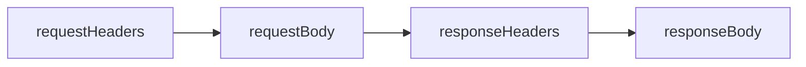

okhttp库的火热程度，相信不需要我多作说明了，网上关于该库的使用和源码分析的文章有如恒河沙数。我就不在这方面凑热闹了，本文从设计模式的角度来谈谈okhttp中都能找到哪些模式。本文所示okhttp版本为3.11.0。

**Builder**
这个应该是很明显的了。`OkHttpClient`、`Request`、`Response`、`MultipartBody`、` HttpUrl`等等随处可见，还如下面表示定义在[RFC 6265](https://tools.ietf.org/html/rfc6265)中的cookie的类：

    public final class Cookie {
      ...
      public static final class Builder {
        ...
      }
    }
本来HTTP是无状态的，但是通过cookie机制，可以让HTTP有状态，比如保持用户登录状态信息。遗憾的是，许多服务器实现并没有使用cookie来保存用户登录状态，而是使用其它一些自定义的请求头。

**Factory Method**
如果简单工厂也算设计模式的话，在okhttp中倒是有很多。不过工厂方法却用的不多。下面是其中2个：

    public interface Call extends Cloneable {
      ...
      interface Factory {  
        Call newCall(Request request);  
      }
    }

    public interface WebSocket {
      ...
      interface Factory {  
        WebSocket newWebSocket(Request request, WebSocketListener listener);  
      }  
    }

**Observer**
观察者有两个，一个是`EventListener`，另一个是`WebSocketListener`。两者都可以看作是*生命周期监听器*，前者监听请求/响应，后者监听web socket。

    public abstract class EventListener {
      ...
	  public void requestHeadersStart(Call call) {}
      public void requestHeadersEnd(Call call, Request request) {}
	  public void requestBodyStart(Call call) {}
	  public void requestBodyEnd(Call call, long byteCount) {}
	  public void responseHeadersStart(Call call) {}
	  public void responseHeadersEnd(Call call, Response response) {}
	  public void responseBodyStart(Call call) {}
	  public void responseBodyEnd(Call call, long byteCount) {}
	  ...
    }

上面列出的方法被称作*Request Events*：

**Singleton**
虽然很不想说，但下面这个确实可以看作是一个单例:no_mouth:：

    public class Platform {
      private static final Platform PLATFORM = findPlatform();
      ...
      public static Platform get() {  
	    return PLATFORM;  
	  }
	  ...
    }

**Strategy**
无论是源码，还是注释中很多地方都有*strategy*、*policy*这样的单词，但真正是策略模式的笔者只发现了`CookieJar`，定义了管理cookie的方法：

    public interface CookieJar {  
	  CookieJar NO_COOKIES = ...
 
	  void saveFromResponse(HttpUrl url, List<Cookie> cookies);
	  List<Cookie> loadForRequest(HttpUrl url);
	}

其它诸如`CacheStrategy`、`ConnectionSpecSelector`，笔者认为都不是策略模式。

**Chain of Responsibility**
okhttp中最核心的部分当属它的HTTP请求拦截器（`Interceptor`）了，这里是一个责任链模式。你们以为我要大谈特谈它了吗？错了，本文到这里就算结束了，关于拦截器的内容，网上太多了，我就不去增加重复的信息了。

> Written with [StackEdit](https://stackedit.io/).
